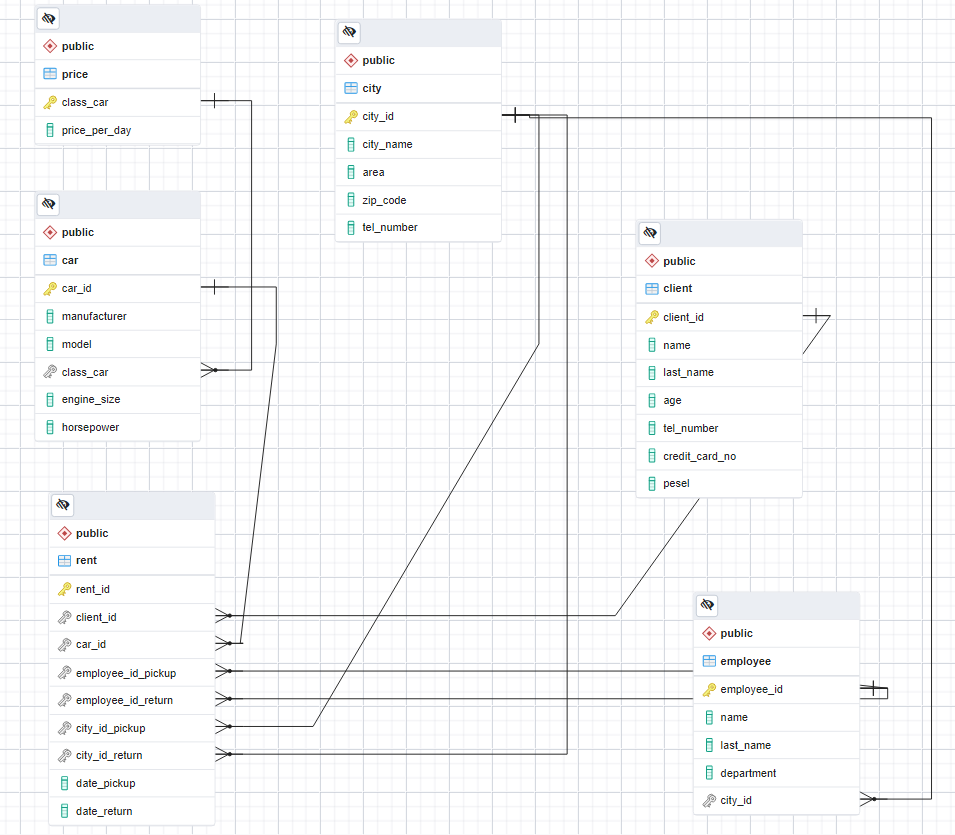

# SQL Project "Car Rental"

Analysis of car rental company data.


## Methodology

Generating random [data](./data/) using [Python](./generate_data.py) Exporting the data to files in SQL format. Querying the database in pgAdmin 4 (PostgresSQL) to perform the following analysis;

## Primary Objective

1. List the car brands that are in the car rental.  
2. List the number of cars by car class.  
3. List the brands of cars that are in class C.  
4. List the number of clients by age.  
5. List selected customers in the following age ranges: 18-24, 25-34, 35-44, 45-54, over 55.  
6. List the employees and the cities and area where they work.  
7. List how many employees work in each area.  
8. Are there customers who have rented a car more than once? If so, who and how many times?  
9. List the number of days for each car rental.  
10. List the sum of rentals of each class of car.  
11. List the amount the customers had to pay for each car rental.  
12. Enter the total amount of all recorded car rentals.  
13. List the phone number of each employee with the department and area.


# Creating  
## Creating databases 

```
CREATE DATABASE car_rental
    WITH
    OWNER = postgres
    ENCODING = 'UTF8'
    CONNECTION LIMIT = -1
    IS_TEMPLATE = False;
```

## Creating tables

#### Table 1. "city"
```
CREATE TABLE city (
	city_id INTEGER NOT NULL,
	city_name VARCHAR(30) NOT NULL,
	area VARCHAR(50) NOT NULL,
	zip_code CHAR(6),
	tel_number INTEGER,
	CONSTRAINT pk_city PRIMARY KEY(city_id)
);
```
```
INSERT INTO city VALUES(1, 'Wroclaw', 'Wroclaw-airport', '54-530', 909962280);
INSERT INTO city VALUES(2, 'Wroclaw', 'Wroclaw-center', '50-102', 917881176);
INSERT INTO city VALUES(3, 'Warszawa', 'Warszawa-airport', '00-906', 506541006);
INSERT INTO city VALUES(4, 'Warszawa', 'Warszawa-center', '00-110', 600048223);
INSERT INTO city VALUES(5, 'Poznan', 'Poznan-airport', '60-189', 356541321);
INSERT INTO city VALUES(6, 'Poznan', 'Poznan-center', '60-778', 635000481);
INSERT INTO city VALUES(7, 'Krakow', 'Krakow-airport', '32-083', 356541321);
INSERT INTO city VALUES(8, 'Krakow', 'Krakow-center', '31-923', 635000481);
```

#### Table 2. "table price"
```
CREATE TABLE price (
	class_car VARCHAR(10),  
	price_per_day DECIMAL(10,2),
	CONSTRAINT pk_class_car PRIMARY KEY(class_car)
);
```
```
INSERT INTO price VALUES('A',109.00);
INSERT INTO price VALUES('B',139.00);
INSERT INTO price VALUES('C',169.00);
```

#### Table 3. "employee"
```
CREATE TABLE employee (
	employee_id INTEGER NOT NULL,
	name VARCHAR(30) NOT NULL,
	last_name VARCHAR(50) NOT NULL,
	department VARCHAR(50) NOT NULL,
	city_id INTEGER NOT NULL,
	CONSTRAINT pk_employee PRIMARY KEY(employee_id),
	CONSTRAINT fk_employee_city_city_id FOREIGN KEY(city_id) REFERENCES city(city_id)
); 

COPY employee
FROM '<ROOT_PATH>\data\employee.txt'
WITH (FORMAT CSV, DELIMITER ';');
```

#### Table 4. "car"
```
CREATE TABLE car (
	car_id INTEGER NOT NULL,
	manufacturer VARCHAR(30) NOT NULL,
	model VARCHAR(50) NOT NULL,
	class_car VARCHAR(10),
	engine_size NUMERIC(2,1),
	horsepower INTEGER,
	CONSTRAINT pk_car PRIMARY KEY(car_id),
	CONSTRAINT fk_car_price_class_car FOREIGN KEY(class_car) REFERENCES price(class_car)
); 

COPY car
FROM '<ROOT_PATH>\data\car.txt'
WITH (FORMAT CSV, DELIMITER ';');
```
#### Table 5. "client"
```
CREATE TABLE client (
	client_id INTEGER NOT NULL,
	name VARCHAR(30) NOT NULL,
	last_name VARCHAR(50) NOT NULL,
	age INTEGER, 
	tel_number VARCHAR(50),
	credit_card_no VARCHAR(50),
	PESEL CHAR(11),
	CONSTRAINT pk_client PRIMARY KEY(client_id)
); 

COPY client
FROM '<ROOT_PATH>\data\client.txt'
WITH (FORMAT CSV, DELIMITER ';');
```
#### Table 6. "rent"
```
CREATE TABLE rent (
	rent_id INTEGER NOT NULL,
	client_id INTEGER NOT NULL,	
	car_id INTEGER NOT NULL,
	employee_id_pickup INTEGER NOT NULL,
	employee_id_return INTEGER,
	city_id_pickup INTEGER NOT NULL,
	city_id_return INTEGER,
	date_pickup DATE,
	date_return DATE,
	CONSTRAINT pk_rent PRIMARY KEY(rent_id),
	CONSTRAINT fk_rent_client_client_id FOREIGN KEY(client_id) REFERENCES client(client_id),
	CONSTRAINT fk_rent_car_car_id FOREIGN KEY(car_id) REFERENCES car(car_id),
	CONSTRAINT fk_rent_employee_employee_id_pickup FOREIGN KEY(employee_id_pickup) REFERENCES employee(employee_id),
	CONSTRAINT fk_rent_employee_employee_id_return FOREIGN KEY(employee_id_return) REFERENCES employee(employee_id),
	CONSTRAINT fk_rent_city_city_id_pickup FOREIGN KEY(city_id_pickup) REFERENCES city(city_id),
	CONSTRAINT fk_rent_city_city_id_return FOREIGN KEY(city_id_return) REFERENCES city(city_id)
); 

COPY rent
FROM '<ROOT_PATH>\data\rent.txt'
WITH (FORMAT CSV, DELIMITER ';');
```

## Entity Relationship Diagram



# Creating queries

## Select information from tables
### 1. List the car brands that are in the car rental.

```
SELECT DISTINCT manufacturer 
FROM car
ORDER BY manufacturer;
```
#### results:
|  |manufacturer |
|--|-------------|
|1 |Acura        |
|2 |Audi         |
|3 |BMW          |
|4 |Buick        |
|5 |Cadillac     |
|6 |Chevrolet    |
|7 |Chrysler     |
|8 |Dodge        |
|9 |Ford         |
|10|Honda        |
--snip--

### 2. List the number of cars by car class.
```
SELECT class_car, count(*) AS "sum"
FROM car
GROUP BY class_car
ORDER BY "sum" DESC;
```
#### results:
|    |class_car  |  sum  |
|----|-----------|-------|
|1   |B          |54     |
|2   |C          |54     |
|3   |A          |49     |

###  3. List the brands of cars that are in class C.
```
SELECT DISTINCT manufacturer 
FROM car
WHERE class_car = 'C'
ORDER BY manufacturer;
```
#### results:
|    |manufacturer |
|----|-------------|
|1   |Acura        |
|2   |Audi         |
|3   |Buick        |
|4   |Cadillac     |
|5   |Chevrolet    |
--snip--

###  4. List the number of clients by age.
```
SELECT age, count(*) AS "sum"
FROM client
GROUP BY age
ORDER BY "sum" DESC;
```
#### results:
|    |age   |sum  |
|----|------|-----|
|1   |45    |10   |
|2   |48    |9    |
|3   |20    |8    |
|4   |39    |7    |
|5   |35    |7    |
--snip--


###  5. List selected customers in the following age ranges: 18-24, 25-34, 35-44, 45-54, 55<

```
SELECT "age_groups", count(*) AS "sum"
FROM (
SELECT age, CASE
	WHEN AGE < 18 THEN 'Under 18'
	WHEN AGE BETWEEN 18 AND 24 THEN '18 - 24'
	WHEN AGE BETWEEN 25 AND 34 THEN '25 - 34'
	WHEN AGE BETWEEN 35 AND 44 THEN '35 - 44'
	WHEN AGE BETWEEN 45 AND 54 THEN '45 - 54'
    WHEN AGE >= 55 THEN 'Over 50'
	END AS "age_groups"
FROM client
) t
GROUP BY "age_groups"
ORDER BY "age_groups";
```
#### results:
|    |age_groups  |sum  |
|----|------------|-----|
|1   |18-24       |33   |
|2   |25-34       |38   |
|3   |35-44       |45   |
|4   |45-54       |49   |
|5   |Over 50     |35   |

### 6. List the employees and the cities and area where they work.

```
SELECT lt.name, lt.last_name, rt.city_name, rt.area	 
FROM employee AS lt
LEFT JOIN city AS rt
ON lt.city_id = rt.city_id
ORDER BY rt.area;
```
#### results:
|    |name        |last_name    |city_name    |area            |
|----|------------|-------------|-------------|----------------|
|1   |Dominik     |	Kała        |Krakow       |Krakow-airport  |
|2   |Nitara      |	Blicharski  |Krakow       |Krakow-airport  |
|3   |Sandra      |	Zabłocki    |Krakow       |Krakow-airport  |
|4   |Strzeżymira |	Pietrasik   |Krakow       |Krakow-center   |
|5   |Hasan       |	Tęcza       |Krakow       |Krakow-center   |
--snip--

###  7. List how many employees work in each area.
  
```
SELECT * FROM employee;
SELECT count(last_name) FROM employee;
	  
SELECT city.area, count(employee.last_name) AS "sum_employee" 
FROM employee
LEFT JOIN city
ON employee.city_id = city.city_id
GROUP BY city.area
ORDER BY "sum_employee" DESC;  
```
#### results:
|    |area                |sum_employee  |
|----|--------------------|--------------|
|1   |Wroclaw-airport     |4             |
|2   |Poznan-airport      |4             |
|3   |Krakow-center       |4             |
|4   |Krakow-airport      |3             |
|5   |Krakow-center       |3             |
|6   |Warszawa-center     |1             |
|7   |Poznan-center       |1             |
|8   |Warszawa-airport    |1             |

###  8. Are there customers who have rented a car more than once? If so, who and how many times?

```
SELECT DISTINCT client_id
FROM rent;

SELECT lt.client_id, rt.name, rt.last_name, COUNT(lt.client_id) AS "sum_rent"
FROM rent AS lt
LEFT JOIN client AS rt
ON lt.client_id = rt.client_id
GROUP BY lt.client_id, rt.name, rt.last_name
HAVING COUNT(lt.client_id) > 1
ORDER BY "sum_rent" DESC;
```
#### results:
|    |client_id  |name       |last_name     |sum_rent  |
|----|-----------|-----------|--------------|----------|
|1   |64	     |Ildefons   |Papież      	|9         |
|2   |185		 |Machut	 |Włodarski		|7         |
|3   |120		 |Lubisław	 |Harasimowicz	|7         |
|4   |161		 |Wioleta	 |Płaza			|7         |
|5   |97		 |Aldona	 |Kluczyński	|6         |
|6   |85		 |Lila	     |Łapka	        |6         |
|7   |66		 |Manfred	 |Janczyk		|6         |
|8   |13		 |Sergiusz	 |Domeracki	    |6         |
|9   |112		 |Dalmira    |Chmura	    |6  	   |
|10  |37		 |Barnaba	 |Fil	        |6	   	   |    
--snip--


### 9. List the number of days for each car rental.

```
SELECT (date_return - date_pickup) AS "sum_day", count(date_return - date_pickup) AS "quantity"
FROM rent
GROUP BY "sum_day"
ORDER BY "quantity" DESC;
```
#### results:
|    |sum_day  |quantity  |
|----|---------|----------|
|1   |1        |50        |
|2   |13       |43        |
|3   |8	       |39        |
|4   |14       |38        |
|5   |9        |38        |
--snip--
  
### 10. List the sum of rentals of each class of car.

```
SELECT rt.class_car, COUNT(rt.class_car) AS "sum"
FROM rent AS lt
LEFT JOIN car AS rt
ON lt.car_id = rt.car_id
GROUP BY rt.class_car
ORDER BY "sum" DESC;
```
#### results:
|    |class_car  |sum   |
|----|-----------|------|
|1   |B          |184   |
|2   |C          |160   |
|3   |A          |156   |

###  11. List the amount the customers had to pay for each car rental.

```
SELECT 
	t2.name, 
	t2.last_name, 
	(t1.date_return - t1.date_pickup) AS "sum_day", 
	((t1.date_return - t1.date_pickup)* t4.price_per_day) AS "sum_price" 
FROM rent AS t1
LEFT JOIN client AS t2
ON t2.client_id = t1.client_id
LEFT JOIN car AS t3
ON t3.car_id = t1.car_id
LEFT JOIN price AS t4
ON t4.class_car = t3.class_car;
```
#### results:
|    |name       |last_name    |sum_day  |sum_price	|
|----|-----------|-------------|---------|----------|
|1   |Edmund     |Ilczuk       |1        |169.00   |
|2   |Sofroniusz |Sternik      |13       |1417.00    |
|3   |Szymon     |Kasiński     |13       |1807.00   |
|4   |Lubisław   |Rynkiewicz   |13       |2197.00    |
|5   |Dominik    |Szarzyński   |3        |327.00    |
--snip--


###  12. Enter the total amount of all recorded car rentals.

```
SELECT 
	sum((t1.date_return - t1.date_pickup)* t4.price_per_day) AS "sum_price" 
FROM rent AS t1
LEFT JOIN car AS t3
ON t3.car_id = t1.car_id
LEFT JOIN price AS t4
ON t4.class_car = t3.class_car;
```
#### results:
|    |sum_price     |
|----|--------------|
|1   |529007.00     |

###  13. List the phone number of each employee with the department and area.

```
SELECT 
	t1.name, 
	t1.last_name,
	t1.department,
	t2.area,
	t2.tel_number
FROM employee AS t1
LEFT JOIN city AS t2
ON t2.city_id = t1.city_id;
```
#### results:

|    |name       |last_name     |department        |area	         |tel_number |
|----|-----------|--------------|------------------|-----------------|-----------|
|1   |Adrian     |Chabowski     |marketing manager |Wroclaw-airport  |909962280  |
|2   |Roch 		 |Juda          |customer service  |Warszawa-airport |506541006  |
|3   |Adrian     |Harasimowicz  |receptionist      |Warszawa-center  |600048223  |
|4   |Lubisław   |Pietrzykowski |marketing manager |Warszawa-center  |600048223  |
|5   |Augustyna  |Fil           |customer service  |Poznan-airport   |356541321  |

--snip--
